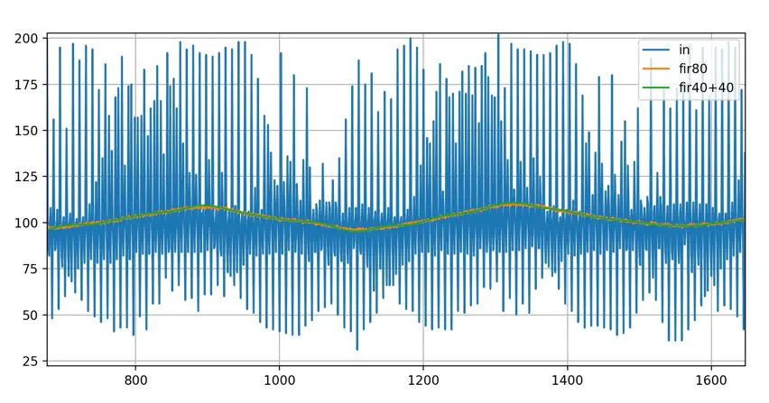
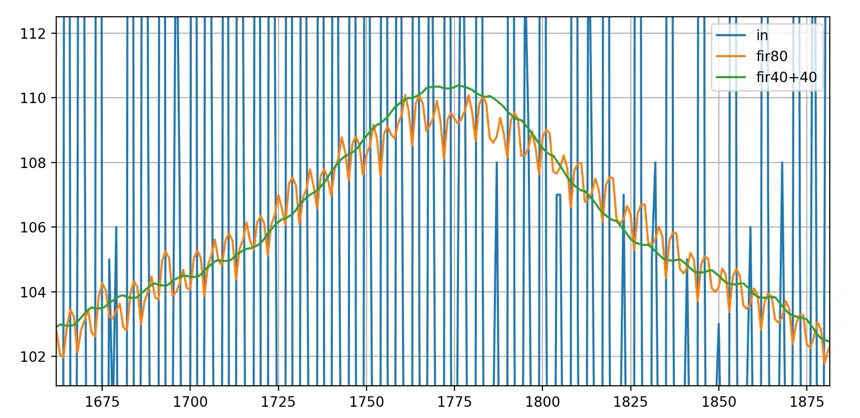
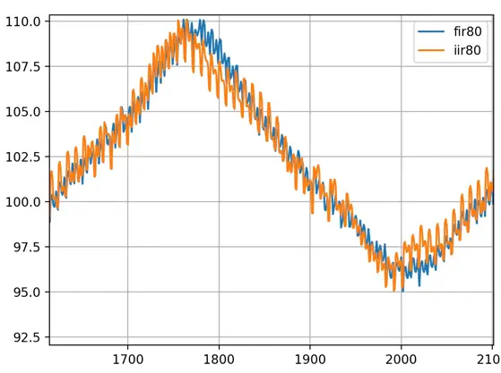
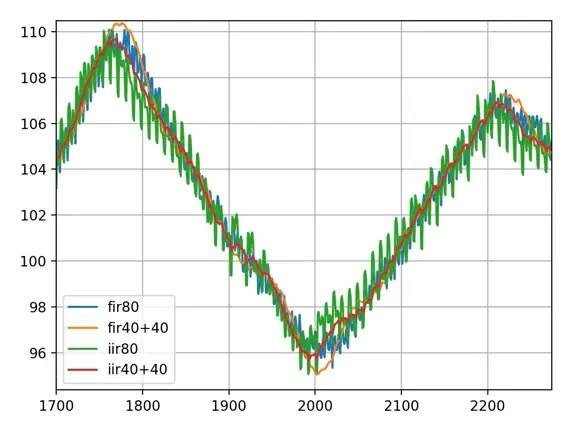

# Noise

The most obvious noise comes from the ADC itself. This noise can easily be reduced by increasing ADC conversion time and
sample averaging.

Another significant noise source are the loads connected to the battery.
The higher the impedance of the battery and wiring, the greater the noise.
Connect the MPPT charger and the loads separetly as close as possible to the battery terminals.
This will reduce noise coupling from the loads to the charger. Keep in mind that high frequency noise
can propagate more easily due to wire inductance, even when using very thick cables.
Noise can degrade tracking performance significantly.

Laptops can have a quite complex noise spectra that is difficult to describe.
A sliding median filter and a averaging filter are a good choice here.

A 50 Hz inverter has an 100 Hz ac component at the input (this is because we "see" `abs(sin(a*t))` at the input).
A notch filter can remove this quite well.

A median filter can filter load bursts.

https://github.com/Krampmeier/uncertainty

# Median

- filter spikes

## Residual Noise

IIR filters have lower memory footprint and work faster compared to FIR.
A disadvantage is the nonlinear phase response. Since we are just measuring dc amplitude, we don't use phase
information.
Soo IIR filters are a good choice.
https://www.ni.com/docs/de-DE/bundle/diadem/page/genmaths/genmaths/calc_filterfir_iir.htm

* use iir
* multipass filters
* adaptive window length for given target noise

Lets have a look at the following signal.
It is the charger output current sampled by ina226 ADC (t_conv=1140µs, avg=1).
The charger was connected to a LFP battery and a cheap china inverter that produces heavy burst noise.
There is a slight 100 Hz ac component due to the sinusodial inverter input which has double the frequency of the 50Hz
220V output.

The useful signal has a triangular waveform, which comes from the MPPT perturbation.

Noisy signal (blue), moving average N=80 (orange) and 2-pass moving average N=40.

The 2-pass filter has a much better noise rejection:

IIR:

2-pass IIR:

- Drop the notch on Vout unless you can show inverter pickup on the scope channel. The biquad adds ~2-sample group delay and ringing risk
  for a benefit you may not be getting (DC-side ripple at 100 Hz on the battery node is usually tiny — the bulk caps absorb it).
    - One-Euro / "α-β with deadband" would be a better fit than EWMA-2pass for Vout: small α when the signal is quiet, large α when |Δ|
      exceeds a threshold. Same code complexity as EWMA, low latency on steps, low noise at steady state. This is essentially what your anf was
      reaching for but applied properly.
    - 1-state Kalman for Vout: state = Vout, model = random walk + control input ΔD·(dV/dD). With a measurement-noise estimate from your
      existing ewm.std, gains adapt automatically. In steady state it collapses to an EWMA, but during sweeps/transients you get faster
      convergence at the same noise floor. Worth doing only if you also feed it ΔD — otherwise just use one-Euro.
    - Don't multi-pass EWMA on the controller input. EWMA_nPass<2> doubles group delay; for a digital controller you usually want the least
      phase lag at given noise rejection. A single-pass EWMA with α tuned to match the 2-pass noise floor has less lag, or use a Butterworth
      biquad LPF (esp-dsp already gives you dsps_biquad_gen_lpf_f32) for a sharper rolloff at the same delay.
    - Anti-alias separately from "smoothing". The control input should be band-limited to <fs/2 of the controller loop, not the ADC. If your
      ADC runs much faster than the control rate, decimate (block-average to controller rate) then run a smaller LPF. Block-averaging N samples
      reduces noise σ by √N with one sample of group delay, which is hard to beat with any IIR.

If I had to make one change today: swap median→notch order, delete anf, and try EWMA_nPass<1> on Vout with a slightly larger span.
Measure controller behavior before adding Kalman/one-Euro.